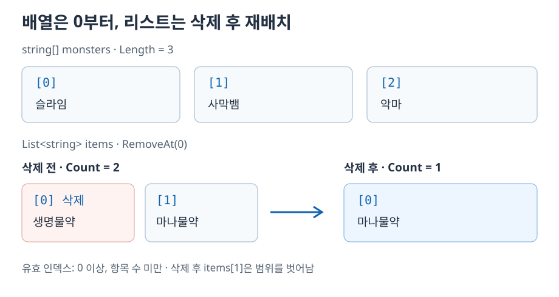
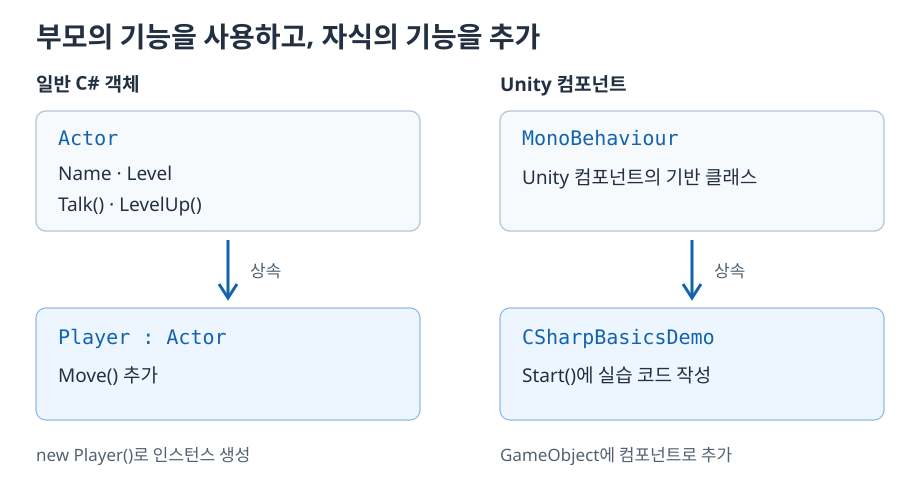
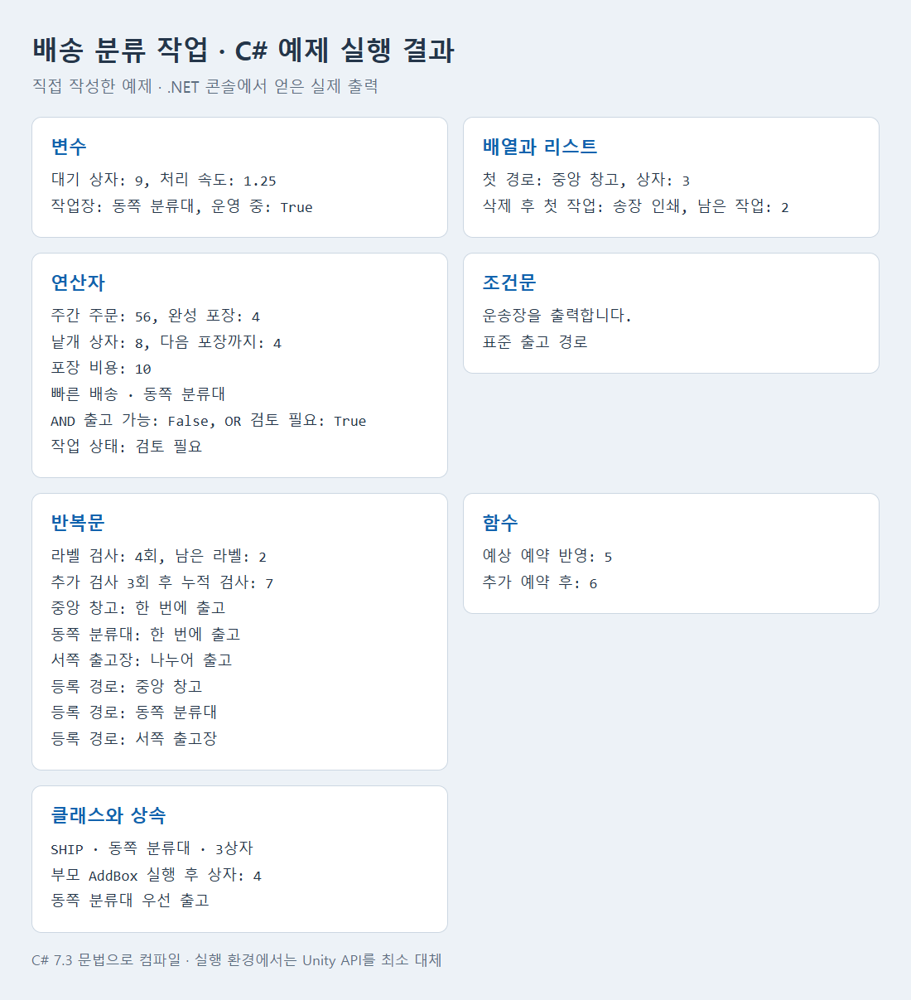

# 유니티 C# 프로그래밍 기초

C#으로 작업 데이터를 저장하고, 조건에 따라 판단하고, 반복되는 작업과 기능을 묶는 방법을 정리한다. 배송 분류대의 상자 수·작업 목록·출고 경로를 예시로 사용한다.

**변수 → 배열·리스트 → 연산자 → 키워드 → 조건문 → 반복문 → 함수 → 클래스·상속** 순서로 익힌다.

짧은 코드 블록은 각 문법을 설명하는 부분 예제다. 전체를 실행해 보려면 [실습 예제](#practice)의 파일 세 개를 사용한다. 수치와 이름은 문법 연습을 위한 예시다.

<a id="contents"></a>

## 목차

1. [변수와 주석](#variables)
2. [배열과 리스트](#collections)
3. [연산자](#operators)
4. [키워드](#keywords)
5. [조건문](#conditions)
6. [반복문](#loops)
7. [함수와 변수의 범위](#methods)
8. [클래스·접근자·상속](#classes)
9. [Unity에서 실습하기](#practice)

---

<a id="variables"></a>

## 1. 변수와 주석

변수는 값을 저장하고 이름으로 다시 사용하는 공간이다. **자료형과 이름을 정하는 선언**, **처음 값을 넣는 초기화**, **이름으로 값을 읽거나 변경하는 사용**을 구분한다.

```csharp
int queuedBoxes = 9;
float conveyorRate = 1.25f;
string stationLabel = "동쪽 분류대";
bool isOpen = true;

Debug.Log(queuedBoxes);
Debug.Log(stationLabel);
```

| 자료형 | 저장하는 값 | 예시 |
| --- | --- | --- |
| int | 정수 | 대기 상자 수, 예약 수 |
| float | 소수점을 포함하는 숫자 | 컨베이어 처리 속도 |
| string | 문자열 | 분류대 이름, 경로 안내 |
| bool | true 또는 false | 운영 여부, 출고 가능 여부 |

`float` 숫자 리터럴에는 `f`를 붙인다. `string` 값은 큰따옴표로 감싸고, `bool`에는 `true` 또는 `false`를 사용한다.

```csharp
int queuedBoxes; // 선언
queuedBoxes = 9;  // 값 대입
Debug.Log(queuedBoxes); // 값 사용

// 이 줄은 작업 메모이며 실행되지 않는다.
```

`//` 뒤에 쓴 내용은 한 줄 주석이다. 변수의 목적이나 확인할 내용을 기록할 때 사용한다. 메서드 안의 지역 변수는 값을 넣은 뒤 읽어야 한다.

---

<a id="collections"></a>

## 2. 배열과 리스트

여러 출고 경로나 처리할 작업을 관리할 때는 같은 자료형의 값을 묶어서 저장한다.

### 배열: 정해진 개수의 값을 저장

자료형 뒤에 `[]`를 붙여 선언하고, 중괄호 안에 초기값을 나열한다.

```csharp
string[] routes = { "중앙 창고", "동쪽 분류대", "서쪽 출고장" };
Debug.Log(routes[0]); // 중앙 창고

int[] routeLoads = new int[3];
routeLoads[0] = 3;
routeLoads[1] = 7;
routeLoads[2] = 12;
```

배열의 첫 인덱스는 **0**이다. 길이가 3인 배열에서는 `0`, `1`, `2`를 사용한다. `new int[3]`은 정수 세 개를 저장할 배열을 만들며, 처음 각 값은 0이다.

### List: 항목 추가와 삭제

리스트는 항목을 추가하거나 삭제하며 사용하는 컬렉션이다. 파일 위쪽에 다음 네임스페이스를 가져온다.

```csharp
using System.Collections.Generic;
```

`List<T>`의 `T`에는 저장할 자료형을 넣는다.

```csharp
List<string> pendingSteps = new List<string>();
pendingSteps.Add("라벨 확인");
pendingSteps.Add("송장 인쇄");
pendingSteps.Add("출고 등록");

pendingSteps.RemoveAt(0);
Debug.Log(pendingSteps[0]); // 송장 인쇄
Debug.Log(pendingSteps.Count); // 2
```



`RemoveAt(0)`으로 라벨 확인을 삭제하면 송장 인쇄와 출고 등록이 앞으로 이동한다. 송장 인쇄는 인덱스 0이 되고, 남은 작업 수는 2다.

| 구분 | 배열 | List |
| --- | --- | --- |
| 생성 | `new int[3]` | `new List<int>()` |
| 항목 수 | `Length` | `Count` |
| 항목 접근 | `routes[position]` | `pendingSteps[position]` |
| 크기 관리 | 만들어진 배열 인스턴스의 길이는 고정 | Add·RemoveAt 등으로 항목 수 변경 |

사용 가능한 인덱스는 `0 이상, 항목 수 미만`이다. 삭제 후 항목이 둘이면 인덱스 0과 1을 사용한다. 이때 `pendingSteps[2]`를 읽으면 범위를 벗어난다. 배열의 범위 초과는 `IndexOutOfRangeException`, 리스트의 범위 초과는 `ArgumentOutOfRangeException`으로 나타난다.

---

<a id="operators"></a>

## 3. 연산자

### 숫자 계산과 문자열 연결

```csharp
int weeklyOrders = 48;
weeklyOrders = weeklyOrders + 13;
weeklyOrders = weeklyOrders - 5;
int completeCrates = weeklyOrders / 12;
int looseBoxes = weeklyOrders % 12;
int spaceToNextCrate = 12 - looseBoxes;
float packingCost = completeCrates * 2.5f;

Debug.Log(weeklyOrders); // 56
Debug.Log(completeCrates); // 4
Debug.Log(spaceToNextCrate); // 4

string servicePrefix = "빠른 배송";
string stationLabel = "동쪽 분류대";
Debug.Log(servicePrefix + " · " + stationLabel);
```

| 연산자 | 역할 |
| --- | --- |
| + | 덧셈, 문자열 연결 |
| - | 뺄셈 |
| * | 곱셈 |
| / | 나눗셈 |
| % | 나눈 뒤의 나머지 |

`int / int`의 결과는 정수다. 56개 주문을 12개씩 포장하면 `56 / 12`는 완성 포장 4개, `56 % 12`는 낱개 상자 8개다. 다음 포장을 채우는 데 필요한 수는 `12 - 8`, 즉 4개다. `%`가 반환하는 것은 나머지이고, 다음 묶음까지 필요한 양은 추가 계산으로 구한다.

`float`는 일반적으로 소수를 근사값으로 저장한다. 이 예제의 `2.5f`는 정확히 표현할 수 있으며, 완성 포장 4개에 대한 비용 계산 결과는 10이다.

### 비교 연산

비교 결과는 `bool`이다. `=`는 대입이고 `==`는 같은지 비교한다.

| 연산자 | 의미 |
| --- | --- |
| == | 같음 |
| != | 다름 |
| > | 초과 |
| < | 미만 |
| >= | 이상 |
| <= | 이하 |

```csharp
bool hasCompleteCrate = completeCrates >= 1;
bool needsLargeTruck = completeCrates > 6;
```

### 논리 연산과 삼항 연산

`&&`는 두 조건이 모두 참일 때 참이고, `||`는 하나라도 참일 때 참이다.

```csharp
int queuedBoxes = 9;
int reservedSlots = 2;
int tripLimit = 8;
bool isOpen = true;

bool canDispatchNow = queuedBoxes <= tripLimit && isOpen; // false
bool needsReview = queuedBoxes > tripLimit || reservedSlots == 0; // true
string workStatus = needsReview ? "검토 필요" : "정상";
```

삼항 연산자는 `조건 ? 참일 때 값 : 거짓일 때 값`으로 쓴다. 위 예제의 `workStatus`에는 `"검토 필요"`가 들어간다.

`&&`는 왼쪽이 거짓이면 오른쪽을 평가하지 않는다. 이 성질을 이용해 `pendingSteps.Count > 0 && pendingSteps[0] == "라벨 확인"`처럼 개수를 먼저 확인할 수 있다.

---

<a id="keywords"></a>

## 4. 키워드

키워드는 C#에서 문법적으로 특별한 의미를 가지는 단어다. `int`, `float`, `string`, `bool`, `new`, `if`, `class`, `return` 등이 있다. 예약어는 일반적인 변수 이름으로 사용할 수 없다.

코드 편집기에서 색이 다르다고 모두 키워드인 것은 아니다. **List는 .NET의 클래스 이름**, **Debug는 Unity의 클래스 이름**이다. `true`와 `false`는 `bool` 값을 표현하는 키워드다.

```csharp
int queuedBoxes = 9;
List<string> pendingSteps = new List<string>();
```

이 코드에서는 `int`와 `new`가 키워드이며, `queuedBoxes`와 `pendingSteps`는 직접 정한 이름이다.

---

<a id="conditions"></a>

## 5. 조건문

### if·else if·else

조건이 참이면 `if` 블록을 실행한다. 거짓이면 다음 `else if` 조건을 확인하고, 맞는 조건이 없으면 `else`를 실행한다. 연결된 조건문에서는 처음 참이 된 분기 하나가 실행된다.

```csharp
if (pendingSteps.Count > 0 && pendingSteps[0] == "라벨 확인")
{
    Debug.Log("주소 라벨을 검수합니다.");
    pendingSteps.RemoveAt(0);
}
else if (pendingSteps.Count > 0 && pendingSteps[0] == "송장 인쇄")
{
    Debug.Log("운송장을 출력합니다.");
    pendingSteps.RemoveAt(0);
}
else
{
    Debug.Log("자동 처리 대상이 없습니다.");
}
```

이 예제는 앞에서 만든 작업 리스트를 사용한다. `pendingSteps[0]`을 확인하기 전에 `Count > 0`을 검사해 빈 리스트 접근을 막는다. 일치한 작업을 처리하고 첫 항목을 삭제한다.

### switch·case·default

하나의 값을 여러 후보와 비교할 때는 `switch`를 사용한다.

```csharp
switch (routes[1])
{
    case "중앙 창고":
    case "동쪽 분류대":
        Debug.Log("표준 출고 경로");
        break;
    case "서쪽 출고장":
        Debug.Log("묶음 출고 경로");
        break;
    default:
        Debug.Log("경로를 확인해 주세요.");
        break;
}
```

`case`는 값이 일치하는 분기, `default`는 일치하는 `case`가 없을 때의 분기다. 위 코드의 `break`는 `switch`를 빠져나간다. 중앙 창고와 동쪽 분류대처럼 같은 처리를 할 값은 실행 코드 앞에 `case`를 나란히 놓을 수 있다.

---

<a id="loops"></a>

## 6. 반복문

### while: 조건이 참인 동안 반복

```csharp
int labelsRemaining = 6;
int scansCompleted = 0;
while (labelsRemaining > 0)
{
    labelsRemaining--;
    scansCompleted++;
    if (scansCompleted == 4)
        break;
}
Debug.Log(labelsRemaining); // 2
```

반복할 때마다 `labelsRemaining--`로 미처리 라벨을 1 줄이고, `scansCompleted++`로 검사 횟수를 1 늘린다. 검사 횟수가 4가 되면 `break`로 반복을 종료한다. `break`는 자신을 감싼 가장 가까운 반복문 또는 `switch`를 빠져나간다.

이 예제는 한 번의 호출 안에서 라벨 4개를 연속 처리한다. 실제 분류대의 처리 시간이나 애니메이션에 맞추려면 시간 제어를 별도로 구현한다. 조건이 계속 참인 반복문은 종료 조건이나 값 변화가 있어야 한다.

### for: 초기화·조건·증감

```csharp
for (int pass = 1; pass <= 3; pass++)
{
    scansCompleted++;
}
Debug.Log(scansCompleted); // 앞의 검사 4회에 3회를 더해 7
```

`for (초기화; 조건; 증감)` 순서로 작성한다. 초기화는 처음 한 번, 조건 검사는 매 반복 전에, 증감은 각 반복이 끝난 뒤 실행한다. `pass`가 1부터 3까지 사용되므로 총 3번 반복한다.

### 배열 탐색과 foreach

```csharp
for (int position = 0; position < routes.Length; position++)
{
    Debug.Log(routes[position]);
}

foreach (string route in routes)
{
    Debug.Log(route);
}
```

배열은 `Length`, 리스트는 `Count`로 반복 범위를 정한다. `index < 항목 수`로 쓰면 마지막 유효 인덱스까지만 접근한다.

`foreach`는 컬렉션에서 항목을 하나씩 가져온다. 각 항목을 읽어 처리하는 작업에는 인덱스 없이 간결하게 쓸 수 있다. 일반적인 List 탐색 중에 항목을 추가·삭제하면 열거가 무효화될 수 있으므로, 삭제 로직은 별도로 설계한다.

---

<a id="methods"></a>

## 7. 함수와 변수의 범위

여러 줄의 동작을 묶어 이름으로 호출하는 단위를 메서드라고 한다. C# 클래스에 작성하는 함수는 메서드이며, `Start()`도 그중 하나다.

### 값을 받고 반환하기

```csharp
private int EstimateSlots(int currentReservations, int incomingReservations)
{
    return currentReservations + incomingReservations;
}
```

- `int` — 반환하는 값의 자료형
- `EstimateSlots` — 메서드 이름
- `currentReservations`, `incomingReservations` — 호출할 때 받는 두 매개변수
- `return` — 계산한 결과를 호출한 곳에 돌려주는 문장

호출할 때는 다음처럼 반환값을 변수에 대입한다.

```csharp
reservedSlots = EstimateSlots(reservedSlots, 3);
```

`int`는 이 예제에서 값으로 전달된다. 매개변수의 이름은 전달하는 변수 이름과 달라도 된다. 예약 2개에 신규 예약 3개를 더한 반환값을 `reservedSlots`에 저장하면 예약 수는 5가 된다.

메서드 정의는 `Start()` 바깥의 클래스 본문에 두고, 호출 코드는 `Start()` 안에 넣는다.

### void와 멤버 변수

반환할 값이 없는 메서드는 `void`로 선언한다. 같은 클래스의 필드를 직접 바꾸는 방식도 가능하다.

```csharp
public class WarehouseBasicsDemo : MonoBehaviour
{
    private int reservedSlots = 2;

    private void Start()
    {
        ReserveOneSlot();
        Debug.Log(reservedSlots); // 3
    }

    private void ReserveOneSlot()
    {
        reservedSlots++;
    }
}
```

| 구분 | 선언 위치와 사용 범위 |
| --- | --- |
| 지역 변수 | 메서드나 블록 안에 선언한다. 해당 범위에서 사용한다. |
| 매개변수 | 메서드가 호출될 때 값을 받으며 해당 메서드에서 사용한다. |
| 멤버 변수·필드 | 클래스 본문에 선언한다. 같은 인스턴스의 메서드들이 접근자 규칙에 따라 사용한다. |

`Start()` 안에 선언한 지역 변수는 다른 메서드에서 바로 사용할 수 없다. 예약 수를 클래스 본문에 필드로 선언하면 같은 클래스의 `Start()`와 `ReserveOneSlot()`이 함께 사용할 수 있다. 이 경우 정확한 명칭은 클래스의 필드이며, 외부에서 접근할 수 있는지는 접근자가 결정한다.

### 반복문에서 메서드 호출

```csharp
private string GetDispatchPlan(int packageCount)
{
    if (packageCount <= tripLimit)
        return "한 번에 출고";
    return "나누어 출고";
}
```

```csharp
for (int position = 0; position < routes.Length; position++)
{
    Debug.Log(routes[position] + ": " + GetDispatchPlan(routeLoads[position]));
}
```

경로 이름과 상자 수 배열의 길이를 맞춘 뒤, 같은 인덱스로 두 값을 읽는다. 실습 컴포넌트의 `tripLimit` 필드는 8이다. 반복·조건·메서드를 조합해 한 번에 보낼 수 있는지 판단한다.

---

<a id="classes"></a>

## 8. 클래스·접근자·상속

### 클래스와 인스턴스

클래스는 데이터와 동작을 하나의 자료형으로 묶는다. 일반 C# 클래스는 `new`로 인스턴스를 만들어 사용할 수 있다.

```csharp
// ShipmentOrder.cs
public class ShipmentOrder
{
    public string Destination = "미정";
    public int BoxCount = 1;
    private string trackingPrefix = "SHIP";

    public string GetSummary()
    {
        return trackingPrefix + " · " + Destination + " · " + BoxCount + "상자";
    }

    public void AddBox()
    {
        BoxCount++;
    }
}
```

```csharp
ShipmentOrder shipment = new ShipmentOrder();
shipment.Destination = "서쪽 출고장";
shipment.BoxCount = 2;
shipment.AddBox();
Debug.Log(shipment.BoxCount); // 3
Debug.Log(shipment.GetSummary());
```

`ShipmentOrder`는 클래스이고, `new ShipmentOrder()`로 만든 객체는 인스턴스다. 인스턴스 변수 뒤의 `.`으로 공개된 필드나 메서드에 접근한다.

### public과 private

| 접근자 | 이 예제에서의 의미 |
| --- | --- |
| public | 외부 코드에서 접근할 수 있도록 공개한다. |
| private | 선언한 클래스 내부에서 사용한다. |

클래스의 필드나 메서드에 접근자를 생략하면 기본 접근성은 `private`다. `shipment.Destination`은 공개된 필드라 사용할 수 있고, `trackingPrefix`는 ShipmentOrder 내부의 `GetSummary()`에서 사용한다.

### 상속

클래스 이름 뒤에 `: 부모클래스`를 붙여 상속 관계를 만든다.

```csharp
// PriorityShipment.cs
public class PriorityShipment : ShipmentOrder
{
    public string GetServiceNotice()
    {
        return Destination + " 우선 출고";
    }
}
```

```csharp
PriorityShipment priorityOrder = new PriorityShipment();
priorityOrder.Destination = "동쪽 분류대";
priorityOrder.AddBox();
Debug.Log(priorityOrder.GetSummary());
Debug.Log(priorityOrder.GetServiceNotice());
```



PriorityShipment는 ShipmentOrder의 공개된 `Destination`, `BoxCount`, `GetSummary()`, `AddBox()`를 사용하면서 `GetServiceNotice()`를 추가한다. 부모의 `private` 멤버에는 자식 클래스가 직접 접근할 수 없지만, 부모가 제공한 메서드는 그 멤버를 사용할 수 있다.

Unity 스크립트의 `public class WarehouseBasicsDemo : MonoBehaviour`도 상속 선언이다. `MonoBehaviour`를 상속한 컴포넌트는 GameObject에 붙여 사용한다. 여기의 ShipmentOrder·PriorityShipment는 일반 C# 객체로 사용한다.

---

<a id="practice"></a>

## 9. Unity에서 실습하기

문법을 연결한 예제를 다음 파일 세 개로 정리했다.

- [WarehouseBasicsDemo.cs](Examples/CSharpBasics/WarehouseBasicsDemo.cs) — 배송 작업으로 변수·조건·반복·함수·상속을 연습하는 컴포넌트
- [ShipmentOrder.cs](Examples/CSharpBasics/ShipmentOrder.cs) — 배송지와 상자 수를 가진 일반 클래스
- [PriorityShipment.cs](Examples/CSharpBasics/PriorityShipment.cs) — ShipmentOrder를 상속하는 우선 배송 클래스

1. 세 파일을 Unity 프로젝트의 `Assets` 아래에 같은 폴더로 복사한다.
2. 스크립트 컴파일이 끝나면 빈 GameObject를 만든다.
3. 그 GameObject에 `WarehouseBasicsDemo`를 컴포넌트로 추가한다.
4. Play를 누르고 Console에서 순서대로 출력되는 내용을 확인한다.

ShipmentOrder와 PriorityShipment는 `new`로 사용하는 일반 클래스다. GameObject에는 `WarehouseBasicsDemo`를 붙인다. 이 예제는 Console로 C# 문법을 확인하는 용도이며, 실제 배송 시스템 연결이나 오브젝트 이동은 구현하지 않는다.

### 직접 작성한 예제 실행 결과



위 화면은 저장소의 예제 코드를 .NET 콘솔 환경에서 실행해 얻은 로그를 정리한 것이다. 검증용 환경에서는 `MonoBehaviour`를 빈 기반 클래스로, `Debug.Log`를 콘솔 출력으로 대체했다. C# 7.3 문법으로 컴파일해 오류·경고 없이 통과했고, 로그의 수치와 분기 결과를 확인했다. Unity Editor에서의 컴포넌트 실행은 별도로 확인해야 한다.

| 확인할 결과 | 예제 결과 |
| --- | --- |
| 첫 작업 삭제 | 송장 인쇄가 인덱스 0, Count는 2 |
| 주문과 포장 계산 | 주문 56개, 완성 포장 4개, 낱개 8개, 다음 포장까지 4개 |
| 논리 연산 | 출고 가능은 false, 검토 필요는 true |
| while 종료와 for 반복 | 라벨 4개 검사 후 2개 남음, 추가 3회 후 누적 검사 7회 |
| 반환값과 멤버 변수 변경 | 예약 5개, 이어서 6개 |
| 경로별 출고 판단 | 중앙·동쪽은 한 번에, 서쪽은 나누어 출고 |
| 부모 메서드 사용 | AddBox 실행 후 PriorityShipment의 상자 수 4 |

이후에는 작업 목록, 출고 기준, 반복 횟수를 바꾸며 출력 결과를 예상한 뒤 확인해 본다.

---

## 이미지와 문법 참고 자료

배열·리스트와 상속 구조도, 예제 실행 결과 화면은 이 문서를 위해 직접 만들었다. 구조도는 설명용이고, 실행 결과 화면은 직접 작성한 코드의 실제 로그를 사용했다.

다음 공식 자료는 문법과 용어를 확인하는 보충 자료다.

- [C# 배열](https://learn.microsoft.com/en-us/dotnet/csharp/language-reference/builtin-types/arrays)
- [List<T>](https://learn.microsoft.com/en-us/dotnet/api/system.collections.generic.list-1)
- [산술 연산자](https://learn.microsoft.com/en-us/dotnet/csharp/language-reference/operators/arithmetic-operators)
- [C# 키워드](https://learn.microsoft.com/en-us/dotnet/csharp/language-reference/keywords/)
- [메서드](https://learn.microsoft.com/en-us/dotnet/csharp/programming-guide/classes-and-structs/methods)
- [접근자](https://learn.microsoft.com/en-us/dotnet/csharp/programming-guide/classes-and-structs/access-modifiers)
- [상속](https://learn.microsoft.com/en-us/dotnet/csharp/fundamentals/object-oriented/inheritance)
- [Unity의 Start](https://docs.unity3d.com/6000.0/Documentation/ScriptReference/MonoBehaviour.Start.html)

---

[목차로 돌아가기](#contents) · [메인 README로 돌아가기](../../README.md#unity)
