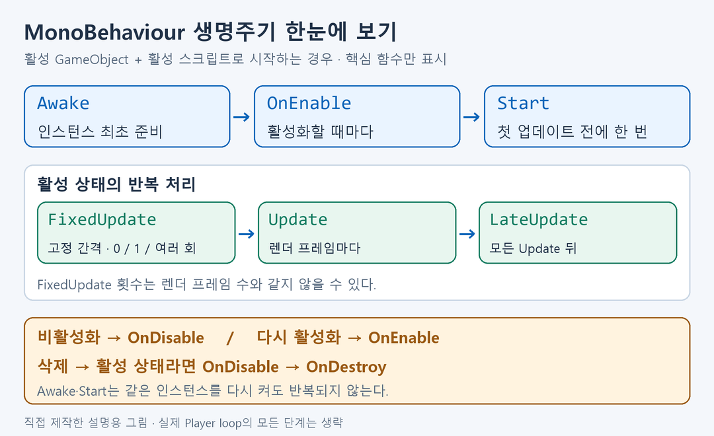
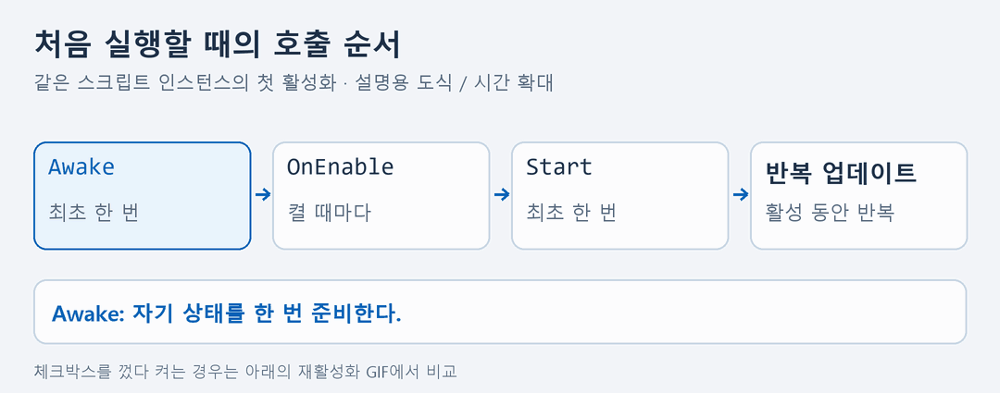
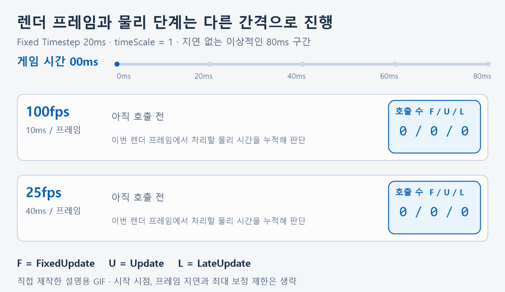
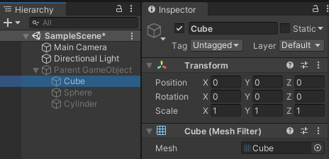
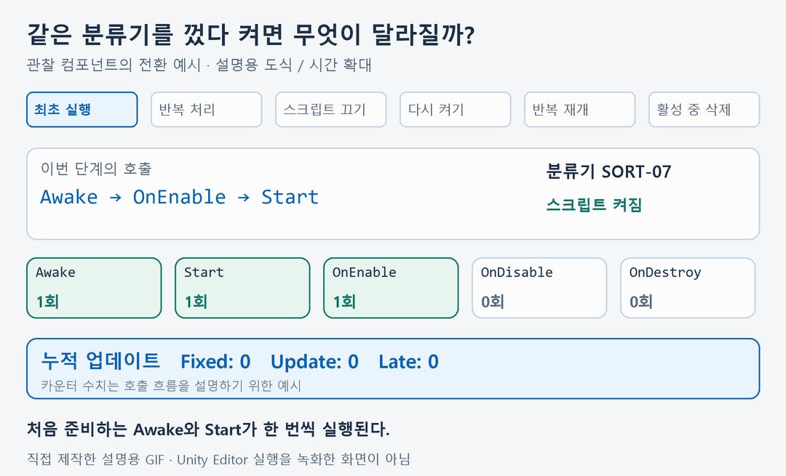

# 유니티 게임오브젝트 생명주기

GameObject에 붙인 `MonoBehaviour`는 준비, 활성화, 반복 처리, 비활성화, 삭제 과정을 거친다. 그때 Unity가 호출하는 함수를 **생명주기 이벤트 함수**라고 한다.

**Awake → OnEnable → Start → 반복 업데이트 → OnDisable → OnDestroy**의 역할을 익히고, 분류기를 껐다 켜며 호출이 달라지는 모습을 확인한다. 실제 물류 처리는 구현하지 않고 로그로 생명주기를 관찰하는 예제다.

GIF 세 개와 요약 그림은 직접 제작한 설명용 도식이다. 호출 사이의 시간을 읽기 쉽게 늘렸으며, Unity Editor를 녹화한 화면은 아니다. Inspector 사진은 Unity 공식 문서의 예시 화면이다.

<a id="contents"></a>

## 목차

1. [전체 흐름과 함수의 역할](#overview)
2. [최초 준비: Awake·OnEnable·Start](#initialization)
3. [반복 처리: FixedUpdate·Update·LateUpdate](#updates)
4. [활성화와 비활성화](#activation)
5. [삭제와 OnDestroy](#destruction)
6. [Console로 직접 확인하기](#practice)
7. [헷갈리기 쉬운 부분](#pitfalls)

---

<a id="overview"></a>

## 1. 전체 흐름과 함수의 역할



이 그림은 **활성 GameObject에 활성 스크립트를 붙여 시작하는 경우**를 기준으로 한다. 비활성 상태로 시작하거나 실행 도중 컴포넌트를 추가하면 호출 시점이 달라질 수 있다.

| 함수 | 언제 호출되는가 | 분류기 기능에 적용한다면 |
| --- | --- | --- |
| `Awake()` | 스크립트 인스턴스가 처음 초기화될 때 한 번 | 자기 컴포넌트 참조와 내부 상태 준비 |
| `OnEnable()` | 활성 GameObject의 스크립트가 사용 가능해질 때마다 | 작업 알림 구독, 활성 상태 표시 |
| `Start()` | 활성 스크립트의 첫 업데이트 전에 한 번 | 다른 오브젝트의 준비가 끝난 뒤 초기 작업 시작 |
| `FixedUpdate()` | 설정된 고정 시간 간격의 물리 단계 | Rigidbody에 힘을 적용하는 처리 |
| `Update()` | 활성 스크립트에서 매 렌더 프레임 | 입력 확인, 일반적인 상태 판단 |
| `LateUpdate()` | 해당 프레임의 모든 Update 이후 | 갱신된 상태를 따라 표시판이나 추적 카메라 정리 |
| `OnDisable()` | 스크립트가 꺼지거나 GameObject가 비활성화될 때 등 | 알림 구독 해제, 활성 동안의 작업 정리 |
| `OnDestroy()` | 컴포넌트나 GameObject가 파괴될 때 등 | 해당 인스턴스가 가진 자원의 최종 정리 |

이 함수들은 Unity가 상황에 맞게 호출한다. `Update()`에서 직접 `Awake()`나 `Start()`를 불러 생명주기를 진행시키지 않는다. 전체 실행 순서는 [Unity 이벤트 함수 실행 순서](https://docs.unity3d.com/6000.0/Documentation/Manual/execution-order.html)를 참고한다.

---

<a id="initialization"></a>

## 2. 최초 준비: Awake·OnEnable·Start



위 GIF는 같은 스크립트 인스턴스가 처음 정상적으로 실행되는 경우다. **Awake와 Start는 한 번**, **OnEnable은 활성화할 때마다** 호출된다.

### Awake: 자기 상태부터 준비

```csharp
private int fixedSteps;

private void Awake()
{
    fixedSteps = 0;
    Debug.Log("분류기 내부 상태를 준비했습니다.");
}
```

`Awake`에는 자기 상태나 컴포넌트 참조처럼 일찍 준비할 내용을 둔다. 활성 GameObject라면 스크립트 체크박스가 꺼져 있어도 `Awake`가 호출될 수 있다. **GameObject 자체가 비활성 상태라면 첫 활성화까지 Awake가 미뤄질 수 있다.**

서로 다른 오브젝트의 `Awake` 순서는 일반적으로 보장되지 않는다. 다른 오브젝트의 `Awake`에서 넣을 값이 이미 준비됐다고 가정하지 않는다. 자세한 조건은 [Awake 공식 API](https://docs.unity3d.com/6000.0/Documentation/ScriptReference/MonoBehaviour.Awake.html)를 참고한다.

### OnEnable: 켜질 때마다 준비

```csharp
private void OnEnable()
{
    Debug.Log("분류기 알림 수신을 시작합니다.");
}
```

같은 인스턴스를 껐다 켜면 `OnEnable`은 다시 호출된다. 첫 실행에서는 `Awake` 다음, `Start` 이전에 호출된다. 실제 알림 구독을 구현한다면 `OnEnable`에서 구독하고 `OnDisable`에서 해제하는 식으로 짝을 맞출 수 있다. 위 코드는 안내 메시지만 출력한다. [OnEnable 공식 API](https://docs.unity3d.com/6000.0/Documentation/ScriptReference/MonoBehaviour.OnEnable.html)

### Start: 첫 업데이트를 시작하기 전에

```csharp
private void Start()
{
    Debug.Log("첫 처리표를 준비했습니다.");
}
```

`Start`는 활성 스크립트의 첫 업데이트 전에 한 번 호출된다. 같은 인스턴스를 다시 켰다고 반복 실행되지 않는다. 비활성 스크립트라면 활성화될 때까지 미뤄질 수 있다.

장면에 처음부터 있던 활성 오브젝트들은 `Awake`로 준비한 뒤 `Start`를 실행한다. 실행 도중 생성되는 오브젝트까지 전부 같은 시점에 준비된다고 가정하지 않는다. [Start 공식 API](https://docs.unity3d.com/6000.0/Documentation/ScriptReference/MonoBehaviour.Start.html)

---

<a id="updates"></a>

## 3. 반복 처리: FixedUpdate·Update·LateUpdate

### FixedUpdate: 물리 단계의 고정 간격

```csharp
private void FixedUpdate()
{
    fixedSteps++;
}
```

`FixedUpdate`는 물리 연산과 관련된 처리를 두는 함수다. 기본 `Fixed Timestep`은 **0.02초**이며, `Time.timeScale = 1`일 때 게임 시간 1초에 약 50회의 물리 단계를 설정한 것과 같다. `Edit → Project Settings → Time`에서 간격을 바꿀 수 있다.

이는 실제 컴퓨터에서 무조건 초당 정확히 50회 실행된다는 뜻은 아니다. 한 렌더 프레임에서 **0회, 1회 또는 여러 번** 호출될 수 있다. 성능, 시간 설정과 지연 처리에 따라 실제 호출 수가 달라진다. [FixedUpdate 공식 API](https://docs.unity3d.com/6000.0/Documentation/ScriptReference/MonoBehaviour.FixedUpdate.html) · [fixedDeltaTime 공식 API](https://docs.unity3d.com/6000.0/Documentation/ScriptReference/Time-fixedDeltaTime.html)

### Update: 렌더 프레임마다 일반 로직

```csharp
private int renderSteps;

private void Update()
{
    renderSteps++;
}
```

`Update`는 활성 스크립트에서 매 렌더 프레임 호출된다. 프레임 수가 많으면 더 자주, 적으면 덜 호출되므로 **항상 초당 60회라고 가정하지 않는다.** 입력 확인이나 주기적인 상태 판단에 사용한다.

시간에 비례해 양을 늘릴 때는 호출 횟수만 세는 코드와 구분해서 `Time.deltaTime`을 고려한다. 이 문서의 카운터는 시간 측정이 아니라 함수의 호출 횟수를 비교하기 위한 것이다. [Update 공식 API](https://docs.unity3d.com/6000.0/Documentation/ScriptReference/MonoBehaviour.Update.html)

### LateUpdate: Update 결과를 확인한 뒤 처리

```csharp
private int lateSteps;

private void LateUpdate()
{
    lateSteps++;
}
```

`LateUpdate`는 그 프레임의 모든 `Update` 호출 뒤에 실행된다. `Update`에서 바뀐 대상 위치를 기준으로 추적 카메라를 맞추는 것이 대표적인 사용 예다. **모든 렌더링 작업이 끝났다는 뜻은 아니다.** [LateUpdate 공식 API](https://docs.unity3d.com/6000.0/Documentation/ScriptReference/MonoBehaviour.LateUpdate.html)

### GIF로 호출 횟수 비교



GIF는 **물리 간격 20ms**, `timeScale = 1`, 지연 없는 이상적인 시간 누적을 가정한다. 10ms 렌더 프레임에서는 물리 단계가 없는 프레임과 한 번 있는 프레임이 번갈아 나타나고, 40ms 렌더 프레임에서는 두 번의 물리 단계가 모인다.

| 80ms 동안의 설명용 예시 | FixedUpdate | Update | LateUpdate |
| --- | --- | --- | --- |
| 렌더 간격 10ms, 100fps | 4회 | 8회 | 8회 |
| 렌더 간격 40ms, 25fps | 4회 | 2회 | 2회 |

실제 Play 시작 시점과 프레임 지연까지 포함한 정확한 횟수를 예측하는 표는 아니다. 핵심은 **FixedUpdate와 Update가 일대일로 대응하지 않는다는 것**이다.

---

<a id="activation"></a>

## 4. 활성화와 비활성화



사진은 Unity 공식 문서의 화면이다. Inspector 상단에서 GameObject 이름 왼쪽 체크박스로 활성 상태를 바꾼다. 사진 속 자식 Cube는 체크돼 있지만 부모가 꺼져 있어 Hierarchy에서 흐리게 표시된다. 실제 활성 상태에는 부모의 상태도 영향을 준다. [GameObject 비활성화 공식 안내](https://docs.unity3d.com/6000.0/Documentation/Manual/DeactivatingGameObjects.html)

### GameObject를 끄는 경우와 스크립트만 끄는 경우

| 조작 | 효과 |
| --- | --- |
| Inspector 맨 위의 GameObject 체크박스 끄기 | 해당 오브젝트의 컴포넌트들과 자식 오브젝트가 비활성 상태가 된다. |
| 붙어 있는 스크립트의 체크박스 끄기 | 그 스크립트의 업데이트가 멈춘다. 오브젝트와 다른 활성 컴포넌트는 계속 존재한다. |
| 체크박스를 다시 켜기 | 활성 조건을 만족하는 스크립트에 OnEnable이 다시 호출된다. |

`OnDisable`은 스크립트를 끄거나 GameObject가 비활성화될 때 호출된다. 파괴나 장면 해제 등에도 호출될 수 있으므로, **OnDisable이 나왔다고 오브젝트가 삭제됐다고 판단하지 않는다.** 이 함수가 반드시 모든 업데이트가 끝난 뒤에만 호출된다고 외우지 않고, 비활성화가 일어나는 시점과 함께 이해한다. [OnDisable 공식 API](https://docs.unity3d.com/6000.0/Documentation/ScriptReference/MonoBehaviour.OnDisable.html)



같은 인스턴스를 다시 활성화하면 `OnEnable`과 반복 업데이트가 재개된다. 이미 실행된 `Awake`와 `Start`는 다시 호출되지 않는다. 삭제 후 새 인스턴스를 만들면 새 생명주기가 시작된다.

코드에서는 다음 API로 조작한다. 다시 켜는 호출은 **계속 활성 상태인 다른 오브젝트의 관리 코드**에서 할 수 있다. 꺼진 스크립트의 `Update`는 실행되지 않는다.

```csharp
// sortingStation은 다른 활성 관리 스크립트가 가진 GameObject 참조다.
sortingStation.SetActive(false);
sortingStation.SetActive(true);
```

`SetActive`는 오브젝트 자체의 `activeSelf`를 바꾼다. 부모가 꺼져 있다면 자식을 `SetActive(true)`로 바꿔도 `activeInHierarchy`는 거짓일 수 있다. 실제 활성 상태가 바뀌어야 관련 콜백이 발생한다. [SetActive 공식 API](https://docs.unity3d.com/6000.0/Documentation/ScriptReference/GameObject.SetActive.html)

---

<a id="destruction"></a>

## 5. 삭제와 OnDestroy

비활성화는 오브젝트를 남겨 두고 멈추는 동작이고, 삭제는 인스턴스를 없애는 동작이다. `OnDestroy`에는 인스턴스가 끝날 때 정리할 내용을 둔다.

```csharp
private void OnDestroy()
{
    Debug.Log("분류기 관찰을 종료합니다.");
}
```

Play 중 Hierarchy에서 오브젝트를 선택하고 삭제해 호출을 확인할 수 있다. 코드에서는 `Destroy(sortingStation)`으로 GameObject와 붙어 있는 컴포넌트를 파괴한다.

`Destroy`로 요청한 실제 삭제는 현재 업데이트 루프 뒤로 미뤄진다. 활성 상태인 오브젝트를 삭제하는 일반적인 경우 `OnDisable`을 거쳐 `OnDestroy`가 호출된다. 이미 비활성화된 오브젝트라면 과거에 발생한 `OnDisable`을 또 발생하는 것처럼 로그를 기대하지 않는다. [Destroy 공식 API](https://docs.unity3d.com/6000.0/Documentation/ScriptReference/Object.Destroy.html)

`OnDestroy`는 **이전에 활성 상태였던 오브젝트**에서 호출된다. Play 종료나 장면 해제 때도 호출될 수 있어, 마지막 로그가 나왔다고 사용자가 직접 삭제한 경우로만 해석하지 않는다. [OnDestroy 공식 API](https://docs.unity3d.com/6000.0/Documentation/ScriptReference/MonoBehaviour.OnDestroy.html)

---

<a id="practice"></a>

## 6. Console로 직접 확인하기

[ConveyorLifecycleProbe.cs](Examples/GameObjectLifecycle/ConveyorLifecycleProbe.cs)는 여덟 생명주기 함수를 가진 관찰용 컴포넌트다. 분류기 코드 `SORT-07`과 `fixedSteps`, `renderSteps`, `lateSteps`로 호출 횟수를 구분한다. 함수별 짧은 코드 블록은 부분 예제이며, 전체 실행에는 이 파일을 사용한다.

### 준비

1. 파일을 Unity 프로젝트의 `Assets` 아래에 복사한다.
2. 빈 GameObject를 만들고 이름을 `SortingStation`으로 정한다.
3. `ConveyorLifecycleProbe`를 붙이고 GameObject와 스크립트를 모두 켜 둔다.
4. `Window → General → Console`을 연다.
5. 호출 순서를 볼 때는 `Collapse`를 끈다. 카운터가 붙은 로그는 매번 내용이 달라 Collapse로 묶이지 않을 수 있다.
6. Play를 누른다. 반복 로그까지 보려면 Inspector의 `Log Continuous Frames`를 켠다. 먼저 켜지 않고 전환 로그만 확인해도 된다.

`Clear`로 이전 메시지를 지우고 확인하면 새 실행과 이전 실행이 섞이지 않는다. Console 설정은 [Console 공식 안내](https://docs.unity3d.com/6000.0/Documentation/Manual/Console.html)를 참고한다.

### 실행 중 관찰할 순서

| 실험 | 기대할 변화 |
| --- | --- |
| 처음 Play 시작 | Awake → OnEnable → Start가 각각 한 번 나온다. 이후 반복 함수가 진행된다. |
| 스크립트 체크박스 끄기 | OnDisable이 나온다. 이 스크립트의 업데이트 카운터는 더 늘지 않는다. |
| 스크립트 체크박스 다시 켜기 | OnEnable이 다시 나온다. Awake·Start는 다시 나오지 않고 카운터는 이어진다. |
| GameObject 체크박스 껐다 켜기 | 활성 조건이 실제로 바뀌면 같은 비활성화·재활성화 흐름을 확인한다. |
| 활성 상태에서 Hierarchy 오브젝트 삭제 | OnDisable, OnDestroy가 나오고 오브젝트가 사라진다. |

전환 로그는 다음 형식으로 나온다. 아래 세 줄은 **출력 형식의 예상 예시**이며, Unity 실행 캡처가 아니다. `frame` 값은 실행 환경마다 달라진다.

```text
[SORT-07] Awake | frame=0 | fixed=0, update=0, late=0
[SORT-07] OnEnable | frame=0 | fixed=0, update=0, late=0
[SORT-07] Start | frame=0 | fixed=0, update=0, late=0
```

`OnDisable`의 마지막 카운터와 다시 켠 뒤의 카운터를 비교한다. 증가가 멈췄다가 이어지고 `Awake`·`Start`가 다시 나오지 않는지 확인한다. `Update`와 `LateUpdate`의 누적 수가 같게 진행되는지, `FixedUpdate`가 다른 수로 증가하는지도 살펴본다.

예제는 C# 7.3 문법으로 컴파일하고, Unity API를 최소 대체한 환경에서 수동 호출해 로그와 카운터의 누적을 확인했다. **Unity Editor에서의 실제 콜백 실행과 Inspector 조작은 아직 검증하지 않았다.** GIF는 공식 동작 규칙을 설명하는 도식이며 실행 증거로 사용하지 않는다.

---

<a id="pitfalls"></a>

## 7. 헷갈리기 쉬운 부분

| 헷갈리는 내용 | 기억할 기준 |
| --- | --- |
| 켤 때마다 Start가 실행된다 | 같은 인스턴스의 Start는 한 번이다. 켤 때마다 호출되는 함수는 OnEnable이다. |
| FixedUpdate는 무조건 초당 50회다 | 기본 고정 간격이 0.02초다. 설정과 게임 시간, 렌더 프레임에 따라 실제 호출 양상이 달라진다. |
| 렌더 프레임마다 FixedUpdate가 한 번이다 | 한 렌더 프레임에 0회 또는 여러 번도 가능하다. |
| Update는 언제나 초당 60회다 | 실행 환경의 렌더 프레임 수에 따라 달라진다. |
| OnDisable은 삭제를 뜻한다 | 꺼졌다가 같은 인스턴스로 다시 켜질 수 있다. |
| 서로 다른 오브젝트도 Awake 순서가 항상 같다 | 일반적인 오브젝트 간 호출 순서는 가정하지 않는다. |
| 비활성 스크립트가 자기 Update에서 다시 켜질 수 있다 | Update가 멈췄으므로 활성 상태인 다른 관리 코드가 필요하다. |
| 함수 이름을 비슷하게 써도 된다 | `OnDestroy`, `FixedUpdate` 등 정확한 철자·대소문자·매개변수를 사용한다. |

---

## 그림 출처와 참고

- `unity-gameobject-activation.png` — [Unity 공식 GameObject 비활성화 안내](https://docs.unity3d.com/6000.0/Documentation/Manual/DeactivatingGameObjects.html)의 Inspector 사진. 저작권: Unity Technologies.
- `lifecycle-overview.png`와 GIF 세 개 — 이 문서를 위해 직접 제작한 설명용 그림. 로그 순서와 시간 예시는 본문의 전제 조건에 따른다.
- 함수별 공식 API 링크는 해당 설명에 함께 표시했다. 기준은 Unity 6.0 문서다.

---

[목차로 돌아가기](#contents) · [유니티 C# 프로그래밍 기초](CSharpBasics.md) · [메인 README로 돌아가기](../../README.md#unity)
