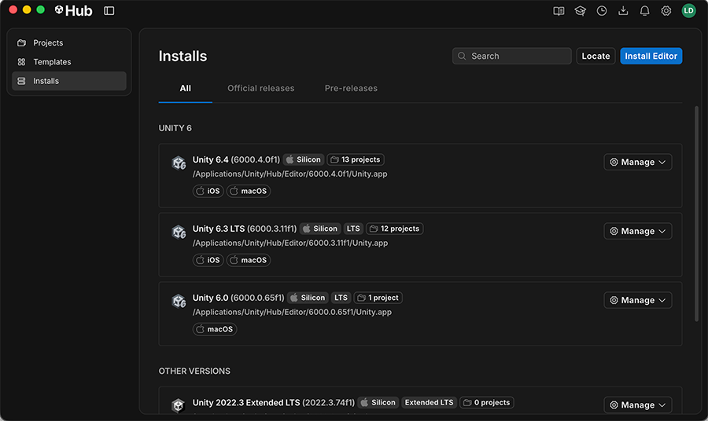
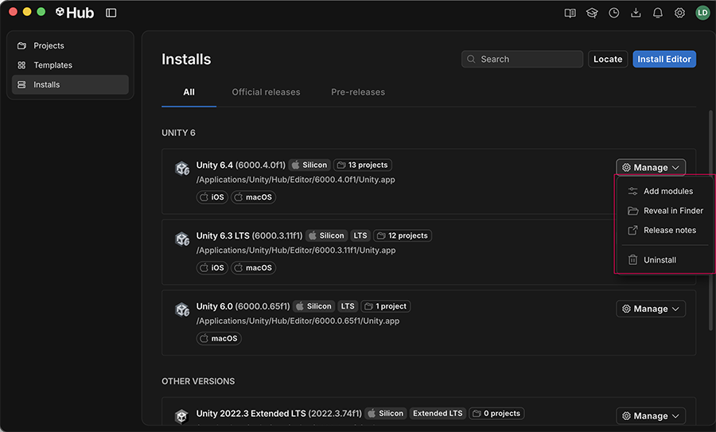
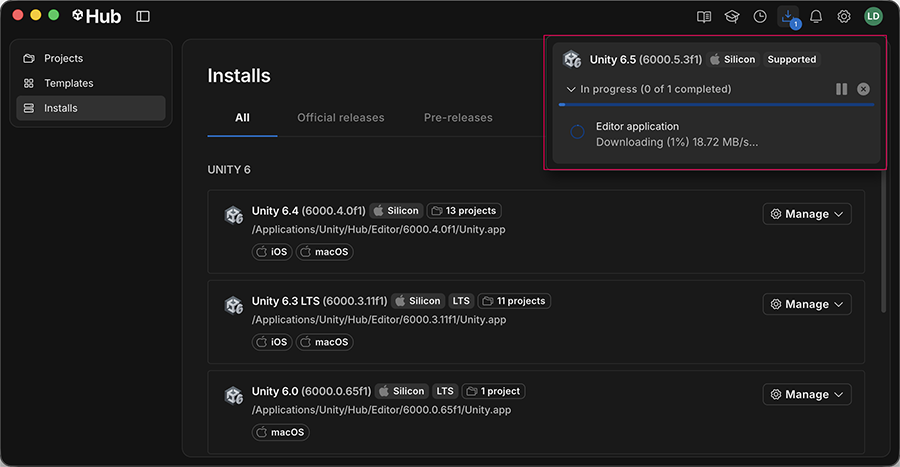
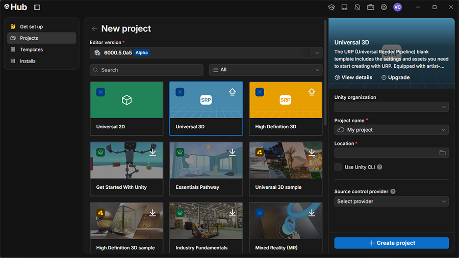

# 유니티 설치방법

Windows에서 Unity Hub를 설치하고, Unity Editor를 준비하는 과정을 정리한다.

Unity Hub는 에디터 버전과 프로젝트를 관리하는 프로그램이고, Unity Editor는 실제로 씬을 구성하고 게임을 개발하는 도구다. **Hub 설치 → 로그인 → Editor 설치 → 프로젝트 생성** 순서로 진행한다.

화면 사진은 Unity 공식 문서의 예시다. 운영체제와 Hub 버전에 따라 모습이 다를 수 있으며, 사진의 버전 번호는 설치할 버전을 지정하는 의미가 아니다.

## 목차

1. [Unity Hub 설치하기](#hub-install)
2. [계정 로그인과 라이선스 확인](#sign-in)
3. [Unity Editor 설치하기](#editor-install)
4. [필요한 모듈 선택하기](#modules)
5. [설치 진행 상태 확인하기](#downloads)
6. [프로젝트 만들기](#new-project)
7. [설치할 때 확인할 점](#pitfalls)

---

## 1. Unity Hub 설치하기

1. [Unity 다운로드 페이지](https://unity.com/download)에 접속한다.
2. Windows용 Unity Hub 설치 파일을 내려받는다.
3. 내려받은 `.exe` 파일을 실행한다.
4. 설치 안내에 따라 설치 위치를 선택하고 설치를 마친다.
5. Unity Hub를 실행한다.

Hub만 설치하면 아직 Editor가 준비된 것은 아니다. 아래 단계에서 사용할 Editor 버전을 설치한다.

설치 파일과 운영체제별 안내는 [Hub 설치 공식 문서](https://docs.unity.com/en-us/hub/install-hub-win-mac)를 참고한다.

---

## 2. 계정 로그인과 라이선스 확인

1. Hub에서 `Sign in`을 선택한다.
2. Unity 계정으로 로그인한다. 계정이 없다면 `Create account`에서 생성한다.
3. 로그인을 마치고 Hub로 돌아온다.
4. 설정의 `Licenses`에서 사용할 라이선스를 확인한다.

현재 Unity Personal은 Hub에 로그인하면 라이선스가 자동으로 활성화된다. 활성화되지 않았다면 `Settings → Licenses → Add license`에서 계정에 해당하는 옵션을 선택한다. Personal을 사용하는 경우 `Get a free personal license`에서 약관을 확인하고 진행한다.

계정과 라이선스 종류에 따른 절차는 [라이선스 관리 공식 문서](https://docs.unity.com/en-us/hub/manage-license)를 참고한다.

---

## 3. Unity Editor 설치하기

왼쪽의 **Installs**와 오른쪽 위의 **Install Editor**를 사용한다.

1. 왼쪽 메뉴에서 `Installs`를 선택한다.
2. 오른쪽 위의 `Install Editor`를 누른다.
3. 사용할 Editor 버전을 선택한다.
4. 해당 버전의 `Install`을 눌러 모듈 선택 단계로 넘어간다.

기존 프로젝트를 열 목적이라면 프로젝트의 `ProjectSettings/ProjectVersion.txt`에서 사용하는 버전을 먼저 확인한다. 새로 시작하는 프로젝트는 사용할 기능과 패키지의 호환성, 지원 기간을 보고 정식 버전을 선택한다. [릴리스 지원 안내](https://unity.com/releases/unity-6/support)에서 LTS와 Update 릴리스의 차이를 확인할 수 있다.

목록에 원하는 버전이 없다면 [Unity Download Archive](https://unity.com/releases/editor/archive)에서 해당 버전의 Hub 설치 링크를 연다.

설치 절차는 [Editor 설치 공식 문서](https://docs.unity.com/en-us/hub/add-editor)를 기준으로 한다.

---

## 4. 필요한 모듈 선택하기

Editor 설치 중 표시되는 모듈 선택 화면에서 필요한 항목을 고른다. 모듈은 플랫폼 빌드 지원, 개발 도구와 언어 팩을 추가하는 구성 요소다. 목록은 운영체제와 Editor 버전에 따라 달라진다.

예를 들어 Android용 게임을 빌드할 예정이라면 `Android Build Support`를 선택하고, 그 아래에 표시되는 SDK·NDK·OpenJDK 항목도 확인한다. 다른 플랫폼은 그 플랫폼에 해당하는 Build Support를 선택한다. Android 구성 요소는 [Android 개발 환경 공식 문서](https://docs.unity3d.com/6000.0/Documentation/Manual/android-sdksetup.html)를 참고한다.

선택을 마친 뒤 `Install`을 눌러 Editor와 모듈을 설치한다. 모듈을 추가하는 방법은 [공식 안내](https://docs.unity.com/en-us/hub/add-modules)를 참고한다.

### 나중에 모듈을 추가하려면

사진처럼 해당 Editor 오른쪽의 **Manage**를 열고 **Add modules**를 선택한다.

1. `Installs`에서 모듈을 추가할 Editor를 찾는다.
2. `Manage → Add modules`를 선택한다.
3. 필요한 항목을 선택하고 `Install`을 누른다.

이 기능은 Hub를 통해 설치한 Editor에서 사용할 수 있다.

---

## 5. 설치 진행 상태 확인하기

오른쪽 위의 **Downloads** 아이콘을 열면 다운로드와 설치 상태가 표시된다.

1. `Downloads`를 열어 Editor와 모듈의 진행 상태를 확인한다.
2. 설치가 완료될 때까지 기다린다.
3. `Installs`에서 설치한 Editor가 목록에 표시되는지 확인한다.

처음 설치하는 버전은 Editor와 모듈을 함께 내려받으므로 시간이 걸릴 수 있다. 진행 상태는 [Editor 설치 공식 문서](https://docs.unity.com/en-us/hub/add-editor)의 Downloads 항목에서 설명한다.

---

## 6. 프로젝트 만들기

위쪽의 **Editor version**, 가운데의 **템플릿**, 오른쪽의 **Project name**과 **Location**을 설정한다.

1. 왼쪽 메뉴에서 `Projects`를 연다.
2. `New project`를 누른다.
3. `Editor version`에서 설치한 버전을 선택한다.
4. 만들 프로젝트에 맞는 2D 또는 3D 템플릿을 선택한다.
5. 템플릿이 설치되지 않았다면 먼저 다운로드한다.
6. `Project name`과 `Location`을 입력한다.
7. `Create project`를 눌러 프로젝트를 만든다.

프로젝트가 Unity Editor에서 열리고 Scene, Hierarchy, Inspector 등의 창이 표시되면 기본 개발 환경이 준비된 것이다. 생성 중 패키지 설치나 에셋 가져오기가 진행되면 작업이 끝날 때까지 기다린다.

사진의 Editor 버전과 선택된 템플릿은 화면 구성 예시다. 자신이 사용할 버전과 템플릿으로 설정한다. 자세한 절차는 [프로젝트 생성 공식 문서](https://docs.unity.com/en-us/hub/project-create)를 참고한다.

---

## 7. 설치할 때 확인할 점

| 상황 | 확인할 내용 |
| --- | --- |
| Hub는 설치했는데 Editor가 없음 | `Installs`에서 Editor 설치까지 마쳤는지 확인한다. |
| 필요한 버전이 목록에 없음 | Download Archive에서 버전을 찾는다. |
| 이미 설치한 Editor를 Hub에 등록하고 싶음 | `Installs → Locate`에서 Editor 위치를 선택한다. |
| `Add modules` 메뉴가 없음 | Hub를 통해 설치한 Editor인지 확인한다. |
| 프로젝트 생성 시 라이선스 안내가 표시됨 | 로그인한 계정과 `Settings → Licenses`의 활성 라이선스를 확인한다. |
| 사진과 메뉴의 위치가 다름 | 사용하는 Hub 버전의 메뉴명과 공식 안내를 확인한다. |

---

## 참고 자료와 사진 출처

설치 방법과 화면 사진은 Unity 공식 문서를 참고했다. 화면 사진의 저작권은 Unity Technologies에 있다.

- [Unity Hub 설치](https://docs.unity.com/en-us/hub/install-hub-win-mac)
- [Unity 라이선스 관리](https://docs.unity.com/en-us/hub/manage-license)
- [Unity Editor 설치](https://docs.unity.com/en-us/hub/add-editor) — Installs, Downloads 화면
- [Editor 모듈 추가](https://docs.unity.com/en-us/hub/add-modules) — Manage 메뉴 화면
- [프로젝트 생성](https://docs.unity.com/en-us/hub/project-create) — New project 화면
- [Unity 릴리스 지원](https://unity.com/releases/unity-6/support)

---

[목차로 돌아가기](#contents) · [메인 README로 돌아가기](../../README.md#unity)
