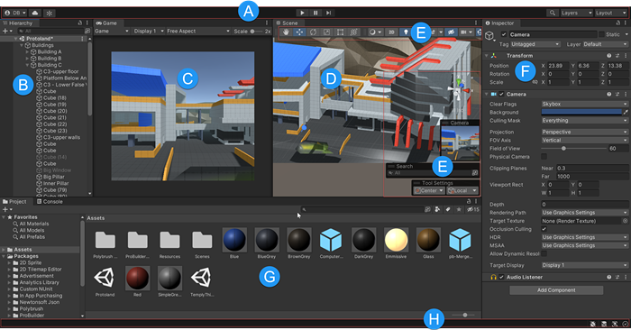
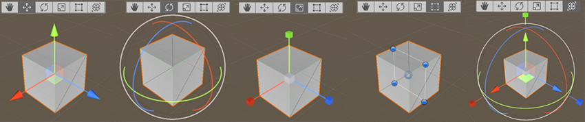
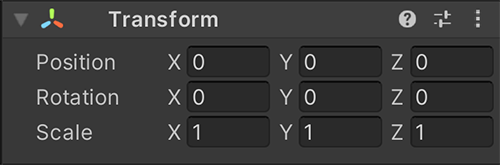

# 유니티 인터페이스와 조작법

새 프로젝트를 만들고, Unity Editor의 주요 창과 오브젝트·시점 조작 방법을 익힌다. Cube 하나를 만든 뒤 도구를 바꾸며 연습하면 각 창의 역할과 조작 결과를 쉽게 확인할 수 있다.

**프로젝트 생성 → 주요 창 확인 → Cube 생성 → 이동·회전·크기 조절 → Scene 시점 조작 → Transform 연습** 순서로 진행한다.

사진은 Unity 공식 문서의 예시 화면이다. Hub와 Editor 버전에 따라 창 배치, 아이콘 위치, 템플릿 이름이 달라질 수 있다. 단축키는 Windows의 기본 설정을 기준으로 한다.

## 목차

1. [새 프로젝트 만들기](#new-project)
2. [주요 창의 역할](#editor-windows)
3. [Cube와 조작 도구](#object-tools)
4. [Scene 시점 조작](#scene-navigation)
5. [Inspector에서 Transform 조절하기](#transform)
6. [기본 도형으로 연습하기](#practice)

---

## 1. 새 프로젝트 만들기

Unity Hub에서 `Projects → New project`를 선택한다. 이전 Hub에서는 버튼이 `New`로 표시되기도 한다.

| 항목 | 설정할 내용 |
| --- | --- |
| Editor version | 프로젝트에서 사용할 설치된 Editor 버전 |
| Template | 2D·3D 등 프로젝트의 기본 구성 |
| Project name | 프로젝트 이름 |
| Location | 프로젝트를 저장할 폴더 |

처음 조작을 연습할 프로젝트라면 기본 3D 템플릿을 선택한다. 템플릿 목록은 선택한 Editor 버전에 따라 달라진다.

설정을 확인한 뒤 `Create project`를 누르면 프로젝트가 만들어지고 Unity Editor가 열린다. 사진 속 `6000.5.0a5 Alpha`와 `Universal 3D`는 공식 문서의 화면 예시이며, 특정 버전이나 렌더 파이프라인을 사용해야 한다는 의미는 아니다.

현재 생성 화면은 [Hub의 프로젝트 생성 안내](https://docs.unity.com/en-us/hub/project-create)를 참고한다.

---

## 2. 주요 창의 역할

먼저 **Project, Hierarchy, Scene, Inspector** 네 곳을 찾아본다.

| 창 | 표시 | 하는 일 |
| --- | --- | --- |
| Project | G | 그래픽, 사운드, 스크립트 등 프로젝트에서 사용하는 파일과 에셋을 관리한다. |
| Hierarchy | B | 현재 열려 있는 Scene의 GameObject 목록과 부모·자식 구조를 확인하고, 오브젝트를 생성하거나 선택한다. |
| Scene | D | 장면을 둘러보며 오브젝트를 배치하고 편집한다. |
| Inspector | F | 선택한 오브젝트나 에셋의 속성을 확인하고 수정한다. |

예를 들어 Cube를 만들면 Hierarchy에 이름이 나타나고 Scene에 도형이 보인다. Cube를 선택하면 Inspector에서 위치, 회전, 크기 같은 속성을 확인할 수 있다.

사진의 `C`는 **Game** 창이다. Scene은 편집을 위한 화면이고, Game은 Scene 안의 게임 카메라가 보여주는 결과를 확인하는 화면이다. 사진에는 창 구분을 위해 두 화면이 나란히 배치되어 있다.

창의 위치보다 이름과 역할을 먼저 익힌다. Editor 레이아웃에 따라 Scene과 Game이 같은 영역의 탭으로 표시될 수도 있다.

---

## 3. Cube와 조작 도구

Hierarchy의 빈 곳에서 마우스 오른쪽 버튼을 누른 뒤 `3D Object → Cube`를 선택한다. 생성된 Cube를 선택하고 마우스 포인터를 Scene 안에 둔 상태에서 도구를 바꿔 본다.

오브젝트에 나타나는 화살표, 회전 링, 사각 핸들처럼 마우스로 조작할 수 있는 표시를 **기즈모**(Gizmo)라고 부른다.

사진의 앞 네 기즈모가 왼쪽부터 `W`, `E`, `R`, `T`에 해당한다.

| 키 | 도구 | 연습할 조작 |
| --- | --- | --- |
| Q | View | Scene에서 왼쪽 버튼을 누른 채 드래그해 보는 위치를 옮긴다. |
| W | Move | 화살표를 드래그해 해당 축 방향으로 오브젝트를 이동한다. |
| E | Rotate | 회전 링을 드래그해 해당 축을 기준으로 회전한다. 가운데 영역을 드래그하면 자유롭게 회전할 수 있다. |
| R | Scale | 축 끝의 핸들을 드래그해 한 축의 크기를 바꾼다. 가운데 핸들을 드래그하면 전체 비율을 유지하며 크기를 바꾼다. |
| T | Rect | 사각형의 모서리와 가장자리 핸들을 조절한다. 2D 오브젝트나 UI 배치에서 특히 많이 사용한다. |

`Q`는 Scene을 보는 위치를 바꾸고, `W·E·R·T`는 선택한 오브젝트를 편집한다. 오브젝트를 움직였는지, 화면만 움직였는지 Inspector의 Transform 값으로 확인해 본다.

---

## 4. Scene 시점 조작

오브젝트를 여러 방향에서 살펴보려면 Scene의 편집용 시점을 움직인다. 다음 조작은 **3D Scene에서 마우스 포인터를 Scene 안에 둔 상태**를 기준으로 한다.

| 조작 | 결과 |
| --- | --- |
| 마우스 오른쪽 버튼을 누른 채 드래그 | 현재 보는 위치에서 시선을 돌린다. |
| Alt + 마우스 왼쪽 버튼을 누른 채 드래그 | 현재 시점의 기준점 주위를 돈다. 오브젝트를 중심으로 놓고 여러 방향에서 관찰할 때 사용한다. |
| 키보드 방향키 | 위·아래 키로 앞뒤 이동, 왼쪽·오른쪽 키로 옆 이동을 한다. |
| 마우스 휠 스크롤 | Scene을 확대하거나 축소한다. |
| 마우스 휠 버튼을 누른 채 드래그 | Scene을 상하좌우로 이동한다. |

Orbit에 사용하는 마우스 버튼은 [공식 Scene 탐색 문서](https://docs.unity3d.com/6000.0/Documentation/Manual/SceneViewNavigation.html)의 Windows 기본 조작인 `Alt + 왼쪽 버튼`으로 정리했다. 같은 문서에서 `Alt + 오른쪽 버튼 드래그`는 확대·축소 조작으로 안내한다.

이 조작은 편집용 Scene 시점을 바꾼다. Hierarchy의 `Main Camera` 오브젝트 위치와 회전이 함께 바뀌는 것은 아니다.

Cube 하나를 두고 시선을 돌리기, 주위를 돌기, 앞뒤 이동, 확대·축소를 차례로 연습한다. 시점만 움직이는 동안 Cube의 Transform 값은 그대로인지 확인한다.

---

## 5. Inspector에서 Transform 조절하기

기즈모를 드래그하는 대신 Inspector의 **Transform**에 숫자를 입력해 위치, 회전, 크기를 조절할 수 있다.

| 속성 | 의미 |
| --- | --- |
| Position | X·Y·Z 방향의 위치 |
| Rotation | X·Y·Z 축을 기준으로 한 회전 각도 |
| Scale | X·Y·Z 방향의 크기 배율. 1은 원래 크기다. |

Cube를 선택하고 `W·E·R`로 조작하면서 어떤 값이 변하는지 확인한다. 이어서 숫자를 직접 입력하고 Scene의 모습이 어떻게 바뀌는지 비교한다.

부모 오브젝트가 있으면 Inspector의 Transform 값은 부모를 기준으로 표시된다. 부모가 없는 기본 Cube로 연습하면 위치와 회전 변화를 이해하기 쉽다.

---

## 6. 기본 도형으로 연습하기

Unity에서 제공하는 기본 도형을 조합해 간단한 형태를 만들어 본다.

1. Hierarchy에서 `3D Object` 메뉴의 Cube, Sphere, Cylinder를 몇 개 만든다.
2. `W`로 위치를 옮기고 `E`로 회전하며 도형을 배치한다.
3. `R`로 각 도형의 크기와 비율을 바꾼다.
4. Inspector의 Transform에 값을 입력해 배치를 조절한다.
5. Scene 시점을 바꾸며 여러 방향에서 형태를 살펴본다.

이동·회전·크기를 조절해 만든 형태가 시점을 바꾸어도 유지되는지 확인한다. 마지막에는 `Quad` 같은 바닥 도형과 그 위의 `Cylinder`를 배치해, 바닥과 플레이어 역할의 오브젝트가 있는 간단한 장면을 준비해 본다.

여기까지는 Editor에서 오브젝트를 배치하는 연습이다. 플레이어가 입력에 따라 움직이게 하려면 이후 스크립트를 작성해 동작을 구현해야 한다.

---

## 사진 출처와 조작 참고

사진 네 장은 Unity 공식 문서에서 가져왔으며 저작권은 Unity Technologies에 있다.

- [Hub 프로젝트 생성](https://docs.unity.com/en-us/hub/project-create) — 새 프로젝트 사진
- [Unity Editor 인터페이스 · 2022.3](https://docs.unity3d.com/2022.3/Documentation/Manual/UsingTheEditor.html) — 창 위치와 문자 표시 사진
- [GameObject 이동·회전·크기 도구 · Unity 6.0](https://docs.unity3d.com/6000.0/Documentation/Manual/PositioningGameObjects.html) — 기즈모 사진과 도구 단축키
- [Transform · Unity 6.0](https://docs.unity3d.com/6000.0/Documentation/Manual/class-Transform.html) — Inspector 사진과 속성
- [Scene 시점 조작 · Unity 6.0](https://docs.unity3d.com/6000.0/Documentation/Manual/SceneViewNavigation.html) — Windows 마우스·키보드 조작

---

[목차로 돌아가기](#contents) · [유니티 설치방법](Installation.md) · [메인 README로 돌아가기](../../README.md#unity)
