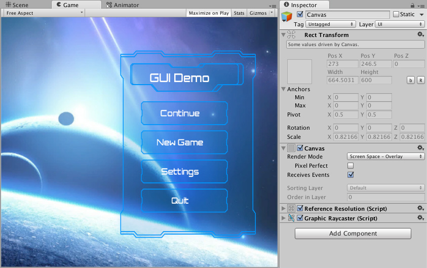
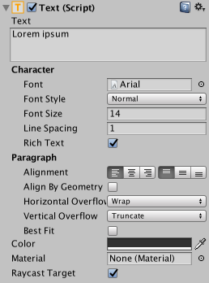
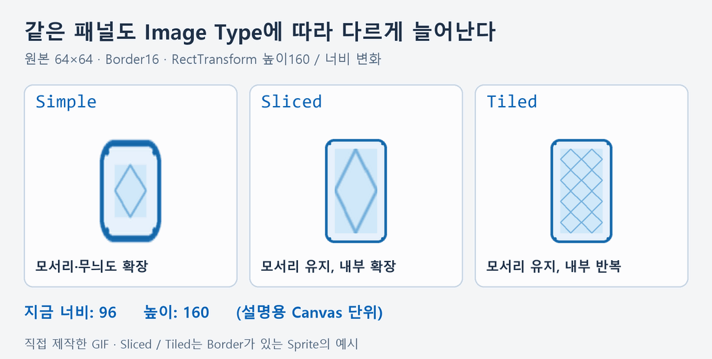
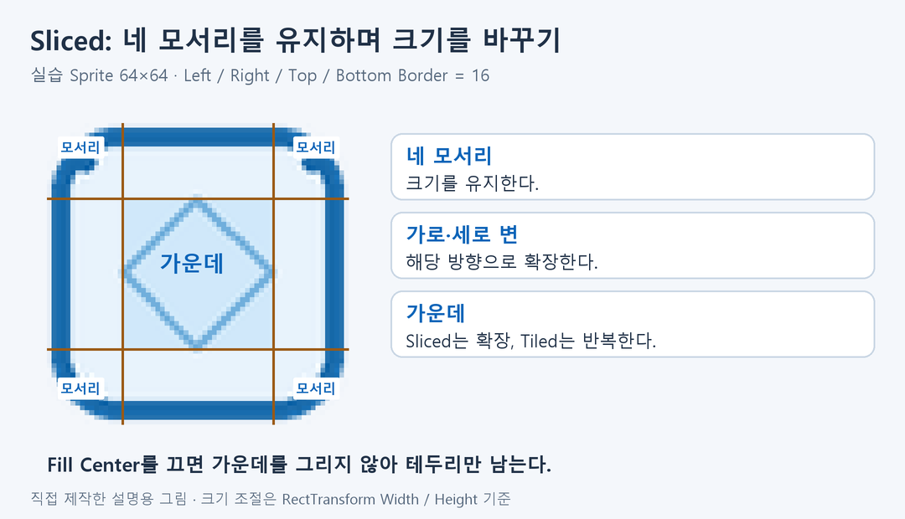
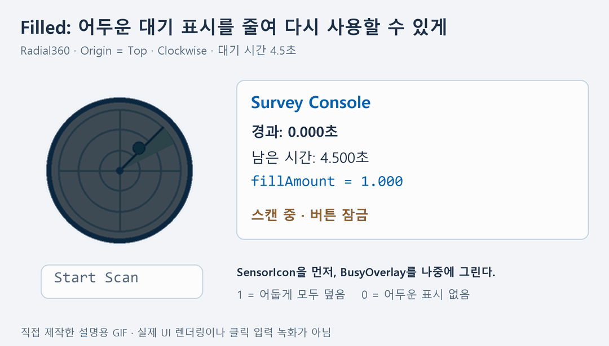
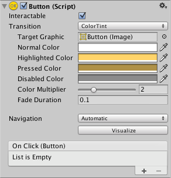
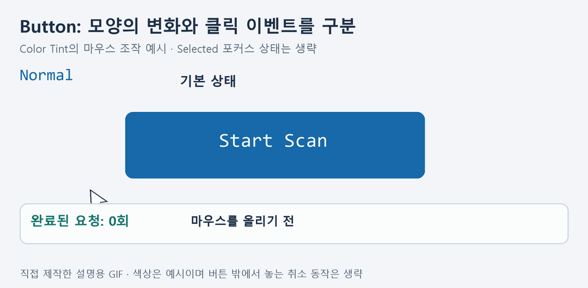
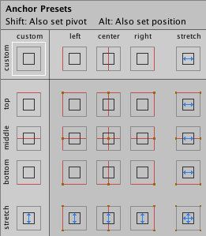
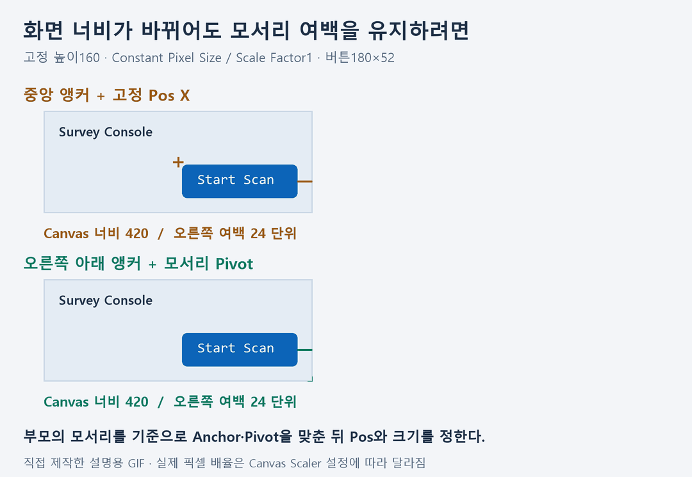

# 유니티 uGUI 기초

Canvas 안에 글자, 이미지, 버튼을 배치하고 화면 크기가 달라져도 원하는 위치를 유지하는 방법을 정리한다. **Canvas → Text → Image → Button → RectTransform·Anchor** 순서로 익힌다.

예시는 관측 장비의 **Survey Console**이다. 버튼 `Start Scan`을 누르면 4.5초 동안 어두운 대기 표시가 줄어들고 다시 사용할 수 있게 만든다. 패널 이름, 코드와 그림은 이 문서를 위해 새로 구성했다.

Inspector와 Canvas 사진 네 장은 Unity 공식 자료다. GIF 네 개와 9분할 그림은 직접 제작한 설명용 도식이며, Unity Editor를 녹화한 화면은 아니다. 색상 변화와 시간은 이해하기 쉽도록 단순화했다.

<a id="contents"></a>

## 목차

1. [Canvas와 화면 좌표](#canvas)
2. [Text: 내용·폰트·줄바꿈](#text)
3. [Image: Sprite와 네 가지 표시 방식](#image)
4. [Filled와 그리기 순서](#filled)
5. [Button: 상태와 On Click 연결](#button)
6. [RectTransform·Anchor·Pivot](#anchors)
7. [관측 패널로 실습하기](#practice)
8. [확인할 문제와 해결 기준](#troubleshooting)

---

<a id="canvas"></a>

## 1. Canvas와 화면 좌표

Hierarchy에서 우클릭한 뒤 `UI → Canvas`를 만든다. 버전에 따라 메뉴가 `UI (Canvas)`로 표시되기도 한다. 장면에 Canvas가 없는 상태에서 Image나 Button을 만들면 Canvas가 함께 생성될 수 있다.



Canvas는 UI가 그려질 영역이며, 글자·이미지·버튼을 그 아래 자식으로 배치한다. Scene 창에서 `2D`를 켜고 Canvas를 선택해 확대하면 화면용 사각 영역을 확인하기 쉽다.

| 구분 | 이해할 기준 |
| --- | --- |
| 월드 공간 | 3D 오브젝트의 위치와 카메라가 있는 공간 |
| 화면 공간 | 사용자가 보는 Game 창의 화면 영역 |
| UI 배치 | Canvas와 부모 RectTransform을 기준으로 배치 |

Screen Space UI의 좌표를 월드 좌표와 같은 값으로 생각하지 않는다. Canvas Scaler가 있으면 RectTransform의 한 단위와 실제 화면의 한 픽셀이 일치하지 않을 수도 있다.

| Canvas Render Mode | 특징 |
| --- | --- |
| Screen Space - Overlay | 화면 위에 UI를 표시한다. 이번 실습의 기준이다. |
| Screen Space - Camera | 지정한 카메라를 기준으로 화면 UI를 표시한다. |
| World Space | UI를 월드 안의 오브젝트처럼 배치한다. |

입력에는 장면의 **EventSystem**과 Canvas의 **GraphicRaycaster**도 필요하다. 장면의 EventSystem을 하나로 유지하고, 프로젝트가 사용하는 입력 시스템에 맞는 Input Module을 사용한다. [Canvas 공식 안내](https://docs.unity3d.com/Packages/com.unity.ugui@2.0/manual/UICanvas.html)

---

<a id="text"></a>

## 2. Text: 내용·폰트·줄바꿈

이 절의 Inspector 항목은 기존 **uGUI Text(Legacy)** 기준이다. 새 실습에서는 `Text - TextMeshPro` 또는 `Text (TMP)`를 사용한다. 두 컴포넌트는 텍스트 표시라는 역할을 공유하지만 Inspector 항목이 모두 같지는 않다.



| Text(Legacy) 항목 | 역할 |
| --- | --- |
| Text | 표시할 문자열 |
| Font·Font Style | 폰트와 굵기·기울임 등 스타일 |
| Font Size | 글자 크기 |
| Line Spacing | 줄 간격. 픽셀 높이를 그대로 입력하는 항목은 아니다. |
| Alignment | 가로·세로 정렬 |
| Horizontal Overflow | 너비를 초과할 때 Wrap 또는 Overflow |
| Vertical Overflow | 높이를 초과할 때 Truncate 또는 Overflow |
| Color | 글자 색상 |

`Wrap`은 너비에 맞춰 줄을 바꾼다. 줄바꿈으로 높이를 넘었을 때 `Truncate`가 설정돼 있으면 들어가지 않는 줄이 생략될 수 있다. `Overflow`는 해당 방향으로 글자를 영역 밖까지 표시할 수 있게 한다. **글자가 안 보이면 먼저 RectTransform의 너비·높이와 Font Size를 확인한다.**

예를 들어 `Survey Console` 제목이 잘리면 영역을 넓히거나 글자 크기를 줄인다. Overflow를 켜는 것만으로 해결하면 이웃 UI를 가릴 수 있다. 제목은 왼쪽 정렬, 버튼 문구는 가운데 정렬처럼 역할에 맞게 정한다. [Text 공식 안내](https://docs.unity3d.com/Packages/com.unity.ugui@2.0/manual/script-Text.html)

TextMeshPro에서는 Font Asset, 줄바꿈과 Overflow 설정을 해당 컴포넌트 기준으로 확인한다. 한국어를 표시한다면 사용 중인 폰트 자산이 그 글자를 포함하는지도 확인한다. 폰트 파일을 추가할 때는 배포·사용 조건을 함께 확인한다. 실습의 UI 문구는 기본 폰트로도 확인하기 쉬운 영문을 사용한다. [TextMeshPro UI 컴포넌트](https://docs.unity3d.com/Packages/com.unity.textmeshpro@3.0/api/TMPro.TextMeshProUGUI.html)

---

<a id="image"></a>

## 3. Image: Sprite와 네 가지 표시 방식

### Sprite로 가져오기

1. PNG 파일을 프로젝트의 `Assets` 아래에 넣는다.
2. Project 창에서 파일을 선택한다.
3. Inspector의 `Texture Type`을 `Sprite (2D and UI)`로 바꾼다.
4. 단일 이미지라면 `Sprite Mode = Single`로 두고 `Apply`를 누른다.
5. Canvas 아래에 Image를 만들고 `Source Image`에 Sprite를 넣는다.

`UnityEngine.UI.Image`는 Sprite를 사용한다. 일반 Texture를 표시하는 `RawImage`와 구분한다. [Image 공식 안내](https://docs.unity3d.com/Packages/com.unity.ugui@2.0/manual/script-Image.html)

### 비율과 원래 크기

| 설정 | 의미 |
| --- | --- |
| Preserve Aspect | 원본 비율을 유지해 주어진 영역 안에 표시한다. RectTransform 자체의 크기를 바꾸는 버튼은 아니다. |
| Set Native Size | Sprite와 Pixels Per Unit 설정에 맞춰 RectTransform 크기를 조절한다. 최종 화면 크기에는 Canvas Scaler도 영향을 준다. |
| Color | Sprite에 색상과 투명도를 적용한다. |

### Image Type 비교

| Image Type | 표시 방식 | 사용할 예 |
| --- | --- | --- |
| Simple | 이미지 전체를 영역에 맞춰 표시 | 장비 아이콘 |
| Sliced | Sprite Border의 9분할을 사용해 모서리를 유지하고 늘어나는 부분을 확장 | 버튼·팝업 테두리 |
| Tiled | 이미지 또는 늘어나는 내부 영역을 반복해 채움 | 반복 무늬 배경 |
| Filled | 방향·방식·양에 따라 일부만 표시 | 진행률·대기 표시 |



GIF는 Border가 있는 패널 Sprite를 기준으로 한다. Simple은 모서리와 무늬도 함께 늘어나고, Sliced는 모서리 크기를 유지하며 내부를 늘린다. Tiled는 내부 무늬를 반복한다. Border가 없는 Tiled 이미지는 전체 Sprite를 반복할 수 있다.

### Sliced와 Fill Center



Sliced를 쓰려면 Sprite Editor에서 Left·Right·Top·Bottom Border를 지정한다. 실습용 [survey-panel-sprite.png](Examples/UGUIBasics/survey-panel-sprite.png)는 64×64이며, Border 네 방향을 각각 **16**으로 설정한다.

네 모서리는 유지하고, 가로 변은 가로로, 세로 변은 세로로 확장한다. 가운데는 나머지 공간을 채운다. `Fill Center`를 끄면 가운데를 그리지 않아 테두리만 남길 수 있다. **Border가 0인 이미지를 Sliced로 바꿨다고 모서리가 자동으로 분리되지는 않는다.** [이미지 표시 방식과 9분할](https://docs.unity3d.com/Packages/com.unity.ugui@2.0/manual/UIVisualComponents.html)

---

<a id="filled"></a>

## 4. Filled와 그리기 순서

`Image Type = Filled`로 바꾸면 `Fill Method`, `Fill Origin`, `Fill Amount`, `Clockwise` 등을 조절할 수 있다.

| 설정 | 역할 |
| --- | --- |
| Horizontal·Vertical | 가로·세로 방향으로 채움 |
| Radial 90·180·360 | 정해진 각도의 방사형 채움 |
| Fill Origin | 시작 기준점 |
| Clockwise | 방사형 채움의 방향 |
| Fill Amount | 표시할 양. 0이면 없음, 1이면 전체 |



관측 패널은 밝은 아이콘 위에 같은 Sprite를 어둡게 겹친다. 스캔을 시작하면 어두운 이미지의 `fillAmount`를 1로 만들고, 남은 시간이 줄어들수록 0까지 낮춘다. 밝은 아이콘이 드러나면서 다시 사용할 수 있음을 보여준다.

```text
Canvas
└── ScanIndicator
    ├── SensorIcon     ← 먼저 그릴 밝은 Image
    └── BusyOverlay    ← 나중에 그릴 어두운 Filled Image
```

같은 Canvas의 일반적인 형제 순서에서는 **Hierarchy에서 뒤에 있는 UI가 나중에 그려져 앞의 UI를 덮는다.** 따라서 BusyOverlay를 SensorIcon 뒤에 둔다. 별도 Canvas의 Sorting 설정까지 이 형제 순서만으로 판단하지 않는다.

두 Image의 RectTransform을 같게 맞추고, 장식용 Image의 `Raycast Target`을 끈다. 위를 덮는 표시가 다른 버튼의 입력을 가로막지 않도록 한다. 그리기 순서는 [Canvas 공식 안내](https://docs.unity3d.com/Packages/com.unity.ugui@2.0/manual/UICanvas.html), 표시량은 [Image.fillAmount API](https://docs.unity3d.com/Packages/com.unity.ugui@2.0/api/UnityEngine.UI.Image.html#UnityEngine_UI_Image_fillAmount)를 참고한다.

---

<a id="button"></a>

## 5. Button: 상태와 On Click 연결

Button은 보통 Image와 Button 컴포넌트를 갖고, 자식 텍스트로 문구를 표시한다. Image는 모양, Button은 입력 반응과 이벤트를 맡는다.



### 상태와 Transition

| 항목 | 의미 |
| --- | --- |
| Interactable | 사용자의 입력을 받을 수 있는지 결정 |
| Color Tint | Normal·Highlighted·Pressed·Disabled 등의 상태에 따라 색상 변경 |
| Sprite Swap | 상태에 따라 다른 Sprite 표시 |
| Fade Duration | 색상 전환에 걸리는 시간 |
| Color Multiplier | 상태 색상에 적용할 배율 |
| Target Graphic | 반응할 때 바꿀 그래픽 |

일부 버전에는 키보드·게임패드 선택 상태의 `Selected Color`도 표시된다. 비활성 상태의 글자와 배경은 구분 가능하게 정한다. Animation 방식은 상태별 애니메이션을 쓰는 추가 방법이며 이번 실습에서는 Color Tint를 사용한다. [Transition 공식 안내](https://docs.unity3d.com/Packages/com.unity.ugui@2.0/manual/script-SelectableTransition.html) · [ColorBlock API](https://docs.unity3d.com/Packages/com.unity.ugui@2.0/api/UnityEngine.UI.ColorBlock.html)



GIF는 마우스 조작의 예시다. 누르는 순간은 Pressed이고, 버튼 안에서 놓아 클릭을 완료했을 때 On Click이 호출된다. 누른 채 버튼 밖으로 이동해 놓으면 클릭이 취소될 수 있다. [Button 공식 안내](https://docs.unity3d.com/Packages/com.unity.ugui@2.0/manual/script-Button.html)

### On Click에 공개 메서드 연결

```csharp
public void StartScan()
{
    Debug.Log("관측 패널: 스캔을 시작합니다.", this);
}
```

위 코드는 이벤트 연결을 설명하는 부분 예제다. 전체 실습 파일은 같은 메서드에서 대기 표시와 버튼 잠금도 처리한다.

1. 메서드를 가진 스크립트를 `SurveyPanel` GameObject에 붙인다.
2. Button Inspector의 `On Click()`에서 `+`를 누른다.
3. **스크립트 파일 자체가 아닌, 해당 컴포넌트가 붙은 GameObject**를 대상 칸에 넣는다.
4. 함수 목록에서 `SurveyPanelController → StartScan()`을 선택한다.
5. Play 중 버튼을 눌렀다 놓아 호출을 확인한다.

매개변수 없는 `public void` 메서드는 이 실습의 연결 대상이다. 함수가 없으면 컴파일 오류, 접근자, 연결한 오브젝트와 컴포넌트를 확인한다.

### Navigation

Navigation은 선택 중인 UI에서 다음 UI로 포커스를 옮기는 규칙이다. None·Horizontal·Vertical·Automatic·Explicit 등을 선택할 수 있다. 기본 이동은 입력 모듈의 Move 입력과 방향키 등을 따른다. **Navigation을 Automatic으로 바꿨다고 Tab 키 이동이 자동으로 구현되는 것은 아니다.** [Navigation 공식 안내](https://docs.unity3d.com/Packages/com.unity.ugui@2.0/manual/script-SelectableNavigation.html)

---

<a id="anchors"></a>

## 6. RectTransform·Anchor·Pivot

UI는 일반 Transform 대신 너비·높이와 앵커를 가진 **RectTransform**으로 배치한다.

| 구분 | 무엇의 기준인가 |
| --- | --- |
| Anchor | 부모 RectTransform 안의 위치 또는 늘어날 범위 |
| Pivot | 자기 사각형 안에서 위치·회전·크기를 다루는 기준점 |
| Pos X·Pos Y | 앵커에 대한 Pivot의 위치 |
| Width·Height | 고정 크기의 사각형 크기 |
| Left·Right·Top·Bottom | Stretch로 앵커가 벌어져 있을 때의 여백 |

앵커와 Pivot의 좌표는 왼쪽·아래가 0, 오른쪽·위가 1인 비율로 이해한다. 왼쪽 위는 `(0, 1)`, 오른쪽 아래는 `(1, 0)`이다.



### 모서리에 고정하기

RectTransform의 Anchor Presets를 열고 원하는 모서리를 선택한다.

| 선택할 때 누르는 키 | 함께 바뀌는 항목 |
| --- | --- |
| 키 없이 선택 | 앵커 |
| Shift를 누르고 선택 | 앵커와 Pivot |
| Alt를 누르고 선택 | 앵커와 위치 |
| Shift + Alt를 누르고 선택 | 앵커·Pivot·위치를 함께 맞춤 |

앵커만 바꾸면 기존 화면 위치를 유지하기 위해 Pos 값이 달라질 수 있다. 먼저 앵커와 Pivot을 정하고, 이후 여백을 입력하면 이해하기 쉽다.

| 관측 패널 요소 | Anchor Min·Max | Pivot | Pos X·Pos Y |
| --- | --- | --- | --- |
| 제목 | `(0, 1)` | `(0, 1)` | `(24, -24)` |
| 스캔 버튼 | `(1, 0)` | `(1, 0)` | `(-24, 24)` |

제목은 왼쪽 위에서 오른쪽으로 24, 아래로 24 떨어진다. 버튼은 오른쪽 아래에서 왼쪽으로 24, 위로 24 떨어진다. 이 예시에서는 두 요소의 Width·Height를 직접 정하고, 부모에 Layout Group을 붙이지 않는다.



GIF는 `Constant Pixel Size`, Scale Factor 1과 고정 높이를 가정한 배치 도식이다. 중앙 앵커에 고정 Pos X만 주면 화면 너비가 바뀔 때 오른쪽 여백도 달라진다. 오른쪽 아래 앵커와 같은 위치의 Pivot을 사용하면 부모의 모서리를 기준으로 지정한 여백이 유지된다.

여백은 **Canvas 단위**다. Canvas Scaler를 `Scale With Screen Size`로 설정하면 실제 픽셀 여백과 요소 크기도 함께 변할 수 있다. Anchor는 위치·늘어날 범위, Canvas Scaler는 전체 배율을 조절한다고 구분한다. [RectTransform·앵커 공식 안내](https://docs.unity3d.com/Packages/com.unity.ugui@2.0/manual/UIBasicLayout.html) · [Canvas Scaler 공식 안내](https://docs.unity3d.com/Packages/com.unity.ugui@2.0/manual/script-CanvasScaler.html)

---

<a id="practice"></a>

## 7. 관측 패널로 실습하기

### 사용할 파일

- [SurveyPanelController.cs](Examples/UGUIBasics/SurveyPanelController.cs) — On Click과 대기 표시를 연결하는 컴포넌트
- [survey-icon.png](Examples/UGUIBasics/survey-icon.png) — 직접 제작한 관측 장비 아이콘
- [survey-panel-sprite.png](Examples/UGUIBasics/survey-panel-sprite.png) — 직접 제작한 9분할 연습용 패널 Sprite

프로젝트의 `Assets/UI/SurveyPanel` 같은 폴더에 복사한다. PNG 두 개는 `Sprite (2D and UI)`로 가져온다. 패널은 Border 네 방향을 16으로 설정한다.

### Hierarchy와 배치

```text
EventSystem
SurveyPanel                  ← SurveyPanelController
Canvas                       ← Screen Space - Overlay
├── PanelTitle               ← Text (TMP): Survey Console
├── ScanIndicator            ← 왼쪽 위, (24, -80), 96×96
│   ├── SensorIcon           ← 밝은 Image, 부모 전체 Stretch
│   └── BusyOverlay          ← 어두운 Image, 부모 전체 Stretch
└── ScanButton               ← 오른쪽 아래, (-24, 24), 180×52
    └── Label                ← Text (TMP): Start Scan
```

1. Canvas를 Overlay로 만들고 GraphicRaycaster와 장면의 EventSystem을 확인한다.
2. 기준 화면은 1280×720으로 잡는다. Canvas Scaler는 `Scale With Screen Size`, Reference Resolution은 `(1280, 720)`, Match는 `0.5`로 설정해 비교한다.
3. 제목은 360×44, 글자 크기 28과 왼쪽 정렬로 설정한다. 왼쪽 위 앵커·Pivot과 `(24, -24)`로 배치한다.
4. ScanIndicator는 왼쪽 위 앵커·Pivot, `(24, -80)`, 96×96으로 배치한다.
5. 두 아이콘 Image에 `survey-icon.png`를 넣는다. BusyOverlay를 뒤쪽 형제로 두고 어두운 색·투명도 약 0.75를 설정한다. 둘 다 Raycast Target을 끈다.
6. ScanButton의 Image에 `survey-panel-sprite.png`를 넣고 Sliced로 설정한다. 버튼 배경의 Raycast Target은 켜고, 자식 Label은 끈다.
7. ScanButton은 오른쪽 아래 앵커·Pivot, `(-24, 24)`, 180×52로 배치한다. Label은 부모 전체 Stretch, 글자 크기 20과 가운데 정렬로 맞춘다.
8. SurveyPanelController의 `Scan Action Button`과 `Busy Overlay Image`에 각각 해당 컴포넌트를 연결한다. 공개 필드가 아니어도 `[SerializeField]`로 Inspector에 표시된다.
9. On Click에 `SurveyPanelController.StartScan()`을 연결한다. Inspector에서 한 번 연결하고 코드에서 중복 등록하지 않는다.
10. Play 중 클릭하고, Game 창의 해상도·가로세로 비율도 바꿔 본다.

실습 스크립트는 Awake에서 Filled·Radial360·Top·Clockwise를 설정한다. 처음에는 표시량 0, 버튼 사용 가능 상태다. 스캔 중에는 표시량이 1에서 0으로 줄고 버튼을 잠근다.

| 스캔 시작 후 경과 시간 | fillAmount | 버튼 |
| --- | --- | --- |
| 0초 | 1 | 비활성 |
| 1.125초 | 0.75 | 비활성 |
| 2.25초 | 0.5 | 비활성 |
| 3.375초 | 0.25 | 비활성 |
| 4.5초 | 0 | 다시 사용 가능 |

이는 `Time.deltaTime`을 누적하는 로직의 예시다. 실제 완료는 업데이트 프레임에서 판정된다. 스크립트가 꺼지면 해당 Update도 멈춘다. 이 예제의 스캔은 UI 타이머를 관찰하는 연습이며 센서 장치나 실제 탐지 시스템과 연결하지 않는다.

C# 7.3 문법으로 컴파일하고 Unity API를 최소 대체한 환경에서 표시량·버튼 잠금·중복 요청·참조 누락 처리를 확인했다. **Unity Editor의 실제 렌더링, 클릭 입력과 해상도별 배치는 아직 검증하지 않았다.** 공식 사진과 설명용 GIF를 실행 검증의 증거로 사용하지 않는다.

---

<a id="troubleshooting"></a>

## 8. 확인할 문제와 해결 기준

| 증상 | 확인할 부분 |
| --- | --- |
| Text가 잘리거나 사라짐 | RectTransform 크기, Font Size, 가로 줄바꿈과 세로 잘림 설정 |
| 한국어가 네모로 표시됨 | 실제 텍스트 컴포넌트의 폰트·글자 포함 여부 |
| Source Image에 PNG를 넣을 수 없음 | Sprite 가져오기 설정과 Apply 여부 |
| 크기를 바꾸니 모서리가 늘어남 | Sliced, Sprite Border, RectTransform Width·Height |
| Filled를 바꿔도 변화가 없음 | Image Type, Fill Amount, 올바른 이미지 참조 |
| 어두운 표시가 뒤에 숨음 | 같은 Canvas에서 형제 순서와 두 이미지의 배치 |
| 버튼이 보이는데 클릭되지 않음 | Interactable, EventSystem, Input Module, GraphicRaycaster, 가리는 Raycast Target |
| 함수가 목록에 없음 | 컴파일 오류, 대상 GameObject, 붙은 컴포넌트, public void 메서드 |
| 해상도를 바꾸면 위치가 달라짐 | 부모 기준의 Anchor, Pivot, Pos·여백과 Canvas Scaler |

---

## 사진·GIF 출처

사진 네 장은 Unity Technologies의 공식 uGUI 2.0 문서에서 가져왔다. 창 배치와 Inspector 항목은 Unity·패키지 버전에 따라 다를 수 있다.

- [Canvas](https://docs.unity3d.com/Packages/com.unity.ugui@2.0/manual/UICanvas.html) — Overlay 화면 사진
- [Text](https://docs.unity3d.com/Packages/com.unity.ugui@2.0/manual/script-Text.html) — Text(Legacy) Inspector 사진
- [Button](https://docs.unity3d.com/Packages/com.unity.ugui@2.0/manual/script-Button.html) — Button Inspector 사진
- [Basic Layout](https://docs.unity3d.com/Packages/com.unity.ugui@2.0/manual/UIBasicLayout.html) — Anchor Presets 사진
- GIF 네 개, 9분할 그림과 실습 Sprite 두 개는 이 문서를 위해 직접 제작했다. GIF의 모양·색상·배율은 본문의 전제에 따른 설명용 표현이다.

---

[목차로 돌아가기](#contents) · [유니티 게임오브젝트 생명주기](GameObjectLifecycle.md) · [메인 README로 돌아가기](../../README.md#unity)
